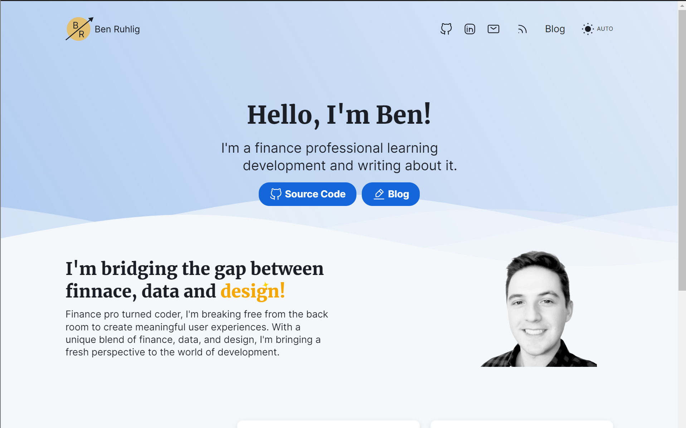

# Ben Ruhlig's Personal Webpage

I am a new developer with a background in finance, and my primary focus is on creating beautiful products and improving my skills in data analysis. I adopt a hands-on approach to learning and enhance my capabilities with a part-time [Master's in Computer & Information Technology at UPenn](https://online.seas.upenn.edu/degrees/mcit-online/).

To kickstart my website, I forked Matt Fantinel's [sveltekit-static-blog-template](https://github.com/matfantinel/sveltekit-static-blog-template). My goal is not to become a front-end engineer. My goal is not to become a front-end engineer but to understand the front-end language well enough to build good-looking minimum viable products (MVPs). By showcasing my projects on this website, I aim to achieve this objective.

<p align="center">
    
</p>

---

# Demo site

You can see the template live [on the demo site](https://sveltekit-static-blog-template.vercel.app/). Additionally, you can check all components in isolation [on Histoire](https://histoire-sveltekit-static-blog-template.vercel.app/).

# Building & Running Locally

To run it locally, you simply have to run:

```shell
# First, install dependencies
npm install
# Then, run it on dev mode
npm run dev
```

The site should now be available at http://localhost:5173/ on your local machine, and your local machine's IP address on your network—great for testing on mobile OSes.

# Histoire / Storybook

I've used [Histoire](https://histoire.dev), a Vite-based Storybook alternative to be able to see and develop components in isolation. To open it, run `npm run story:dev`.

# Image Optimization

This website uses [image-transmutation](https://github.com/matfantinel/image-transmutation) to automatically optimize images used in the site. This means that even if you use non-optimal image formats (like lossless PNGs), it will go over the images and convert images to WebP and AVIF for you, as long as you use the `<Image />` component instead of ``. This is done on build, so it doesn't change anything when running the website locally.

# Managing Posts

All posts are Markdown files that are processed with [MDsveX](https://mdsvex.pngwn.io/) to allow using Svelte components inside them. In order to make it easier to manage posts, I highly recommend the [Front Matter VS Code extension](https://frontmatter.codes/), which gives you a nice CMS-like UI.

# Hosting

When you run `npm run build`, the website will be compiled into a static site, which means you can host it pretty much anywhere. Some free alternatives I recommend are GitHub Pages, Vercel and Netlify.
